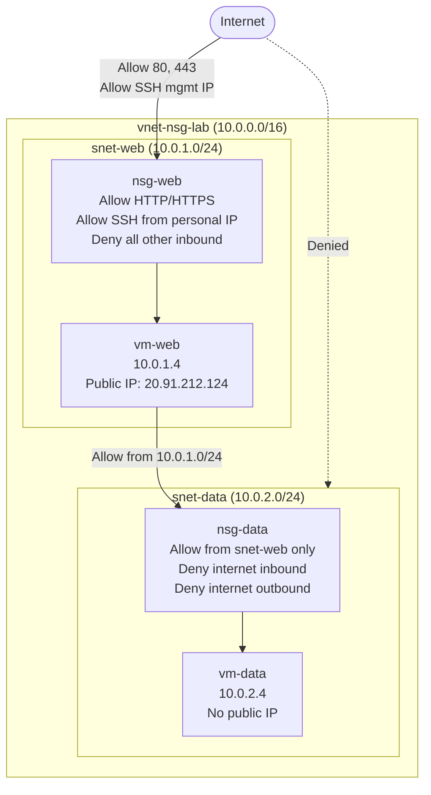

# Architecture

## Overview

This lab simulates a two-tier segmented network consisting of a web tier and a data tier. The web tier is exposed to the internet and accepts inbound HTTP/HTTPS and SSH from a designated management IP. The data tier is fully isolated from the internet and accepts traffic from the web tier only. NSGs on each subnet enforce the boundary between tiers and control all inbound and outbound traffic flow.

---

## Diagram

---

## Design Decisions

**NSGs are attached at the subnet level rather than per NIC.** Subnet-level attachment is simpler to manage and scales better when additional VMs are added to a tier. Any new VM in the subnet inherits the rules automatically, with no per-NIC configuration required. It also makes the tier boundary explicit and visible at the network level.

**vm-data has no public IP.** Without a public IP there is no route from the internet to the VM, meaning it cannot be reached from outside the VNet regardless of NSG rules. The NSG rules on `snet-data` add a second layer on top of this.

**Separate NSGs per subnet rather than a shared NSG.** Each tier has different traffic requirements so each gets its own NSG with rules scoped to that tier. A shared NSG would accumulate rules for both tiers, increasing complexity and the risk of an overly permissive rule unintentionally applying to the wrong subnet.
