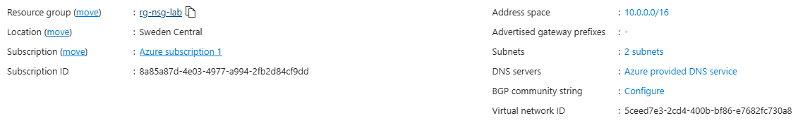
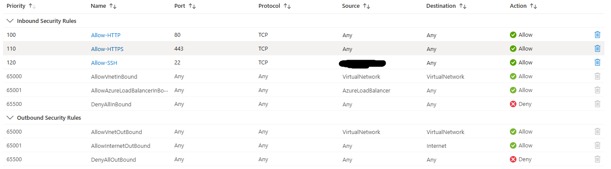
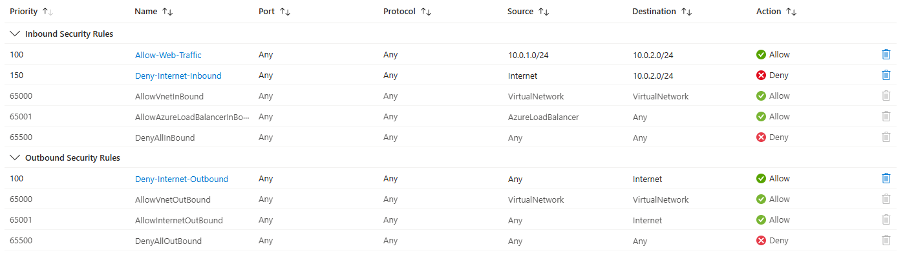
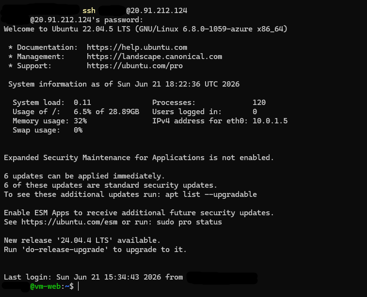
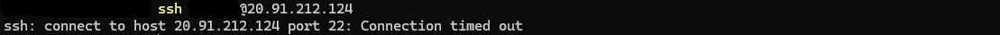

# Traffic Verification

## VNet Overview



---

## NSG Rules

### nsg-web

| Priority | Name | Port | Protocol | Source | Destination | Action |
|---|---|---|---|---|---|---|
| 100 | Allow-HTTP | 80 | TCP | Any | Any | Allow |
| 110 | Allow-HTTPS | 443 | TCP | Any | Any | Allow |
| 120 | Allow-SSH-Mgmt | 22 | TCP | My IP | Any | Allow |



---

### nsg-data

| Priority | Name | Port | Protocol | Source | Destination | Action |
|---|---|---|---|---|---|---|
| 100 | Allow-From-Web-Subnet | Any | Any | 10.0.1.0/24 | Any | Allow |
| 150| Deny-Internet-Inbound | Any | Any | Internet | Any | Deny |
| 100 | Deny-Internet-Outbound | Any | Any | Any | Internet | Deny |




---

## Tests

### Test 1 — SSH to vm-web from authorised IP

**Command:**
```bash
ssh azureuser@20.91.212.124
```

**Expected:** Connection succeeds — permitted by `nsg-web` rule `Allow-SSH`  
**Result:** Success



---

### Test 2 — SSH to vm-web from unauthorised IP

**Command:**
```bash
ssh azureuser@20.91.212.124
```

**Expected:** Connection refused — no matching allow rule in `nsg-web` for this source IP, caught by `DenyAllInBound`  
**Result:** Connection timed out / refused



---

### Test 3 — HTTP traffic to vm-web

**Command:**
```bash
curl http://20.91.212.124
```

**Expected:** nginx default page returned — permitted by `nsg-web` rule `Allow-HTTP`  
**Result:** Success


---

### Test 4 — Traffic from vm-web to vm-data

**Command:**
```bash
ping -c 4 10.0.2.4
```

**Expected:** Ping succeeds — source IP `10.0.1.x` matches `nsg-data` rule `Allow-From-Web-Subnet`  
**Result:** Success


---

### Test 5 — Outbound internet traffic from vm-web

**Command:**
```bash
curl --connect-timeout 10 http://example.com
```

**Expected:** Response received — `snet-web` has no outbound internet deny rule  
**Result:** Success


---

### Test 6 — Outbound internet traffic from vm-data

**Command:**
```bash
curl --connect-timeout 10 http://example.com
```

**Expected:** Connection times out — blocked by `nsg-data` rule `Deny-Internet-Outbound`  
**Result:** Failed — connection timed out


---

## Effective Security Rules

### vm-web NIC


---

### vm-data NIC

